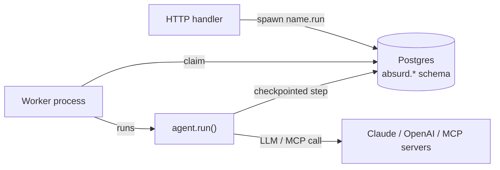

# agent-workflow

Durable, crash-safe Pydantic AI agents on Postgres alone - no Redis, no message broker, no daemon. The whole `agent.run()` becomes one durable [Absurd](https://github.com/earendil-works/absurd) workflow; every model and MCP call inside it is checkpointed, so a worker crash resumes from the last completed step instead of restarting - and without re-spending tokens.

It's the Postgres-only analogue of Pydantic AI's Temporal integration: the run is the workflow.

## Architecture



The repo ships one package:

- **[`pydantic-ai-absurd`](src/pydantic-ai-absurd)** wraps a Pydantic AI `Agent` so the whole run is a durable Absurd task. Register it with `register_task=True`, spawn `<name>.run`, and a crashed worker replays from the checkpoint - no tokens re-spent.

## Use it

```python
from absurd_sdk import AsyncAbsurd
from pydantic_ai import Agent
from pydantic_ai_absurd import AbsurdAgent

absurd = AsyncAbsurd('postgresql://localhost/absurd', queue_name='agents')
agent = AbsurdAgent(Agent('openai:gpt-5.2', name='analyst'), absurd, name='analyst', register_task=True)

# HTTP side: enqueue a durable run, return immediately.
await absurd.spawn('analyst.run', {'prompt': 'analyse Q3 revenue'})

# Worker side (separate process): claim and run durably.
await absurd.start_worker()
```

The run survives restarts mid-flight: when the worker comes back, Absurd replays from the last checkpoint and execution continues where it stopped. A follow-up turn can pass a serialized `message_history` to continue the conversation. See [`pydantic-ai-absurd`'s README](src/pydantic-ai-absurd/README.md) for the full API, and [`examples/durable_run.py`](examples/durable_run.py) for a runnable end-to-end version.

## Develop

```bash
scripts/install   # uv sync --all-packages
scripts/check     # ruff format --check + ruff check + mypy strict
scripts/test      # pytest + 100% coverage gate
```

Tests run against a real Postgres via `testcontainers`. Docker must be up.

The example under `examples/` can be smoke-tested end-to-end against real OpenAI (kept out of CI - local use only):

```bash
OPENAI_API_KEY=... uv run pytest examples/tests/
```

The tests auto-skip when `OPENAI_API_KEY` isn't set.
