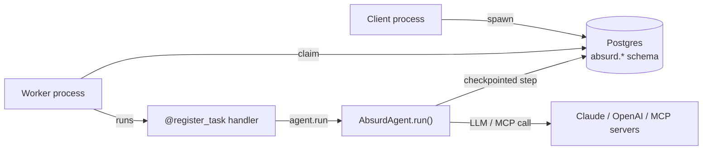

# agent-workflow

Durable, crash-safe Pydantic AI agents on Postgres alone - no Redis, no message broker, no daemon. Call `agent.run(...)` inside an [Absurd](https://github.com/earendil-works/absurd) task and every model and MCP call inside the run is checkpointed, so a worker crash resumes from the last completed step instead of restarting - and without re-spending tokens.

It's the Postgres-only analogue of Pydantic AI's Temporal integration: you author the task, and the agent is a durable callable inside it.

## Architecture



The repo ships one package:

- **[`pydantic-ai-absurd`](src/pydantic-ai-absurd)** wraps a Pydantic AI `Agent` so its `run()` is durable when called inside an Absurd task. Each model and MCP call is a checkpoint; a crashed worker re-runs the task and replays the checkpoints - no tokens re-spent.

## Use it

```python
from absurd_sdk import AsyncAbsurd
from pydantic_ai import Agent
from pydantic_ai_absurd import AbsurdAgent

absurd = AsyncAbsurd('postgresql://localhost/absurd', queue_name='agents')
agent = AbsurdAgent(Agent('openai:gpt-5.2', name='analyst'), absurd, name='analyst')

@absurd.register_task(name='analyse')
async def analyse(params, ctx):
    result = await agent.run(params['prompt'])
    return {'output': result.output}

# Client process: enqueue a durable run, return immediately.
await absurd.spawn('analyse', {'prompt': 'analyse Q3 revenue'})

# Worker process (separate container): claim and run durably.
await absurd.start_worker()
```

The run survives restarts mid-flight: when the worker comes back, Absurd re-runs the handler, the checkpointed model/MCP calls return cached results, and execution continues where it stopped. `spawn` only writes to Postgres, so the client and worker can be separate containers. See [`pydantic-ai-absurd`'s README](src/pydantic-ai-absurd/README.md) for the full API and conversation handling, and [`examples/durable_run.py`](examples/durable_run.py) for a runnable end-to-end version.

## Develop

```bash
scripts/install   # uv sync --all-packages
scripts/check     # ruff format --check + ruff check + mypy strict
scripts/test      # pytest + 100% coverage gate
```

Tests run against a real Postgres via `testcontainers`. Docker must be up.

The example under `examples/` can be smoke-tested end-to-end against real OpenAI (kept out of CI - local use only):

```bash
OPENAI_API_KEY=... uv run pytest examples/tests/
```

The tests auto-skip when `OPENAI_API_KEY` isn't set.
