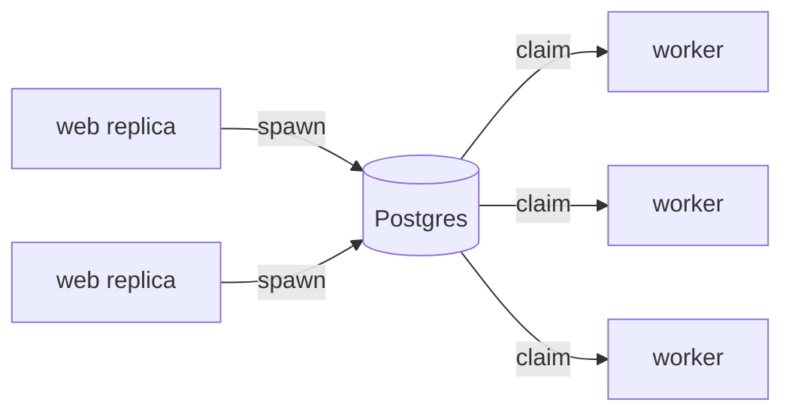

# Running in production

You've got a durable run working on your laptop. Now you want to ship it — to a web app that spawns work and a fleet of workers that does it. This page covers how the pieces split across processes, how to scale them, how to carry a conversation across runs, and the handful of gotchas that are much nicer to read about here than to discover at 3 a.m.

## Two processes, one database

The single most important idea for production is that **`spawn` and `start_worker` belong in different processes.**

- Your **web app** (or cron job, or queue consumer) calls `spawn`. It just writes a row to Postgres and returns. It stays small, fast, and stateless.
- Your **workers** call `start_worker`. They claim rows and run the agent. They're where the CPU, memory, and time go.

They never talk to each other directly — only through Postgres. Which means you can deploy them as separate containers and scale them independently.



=== "Web process"

    ```python
    # Only needs to spawn. No agent, no task registration.
    absurd = AsyncAbsurd(DATABASE_URL, queue_name="agents")

    @app.post("/reports")
    async def create_report(prompt: str):
        handle = await absurd.spawn("analyse", {"prompt": prompt})
        return {"task_id": handle["task_id"]}
    ```

=== "Worker process"

    ```python
    # Registers the tasks and runs them.
    absurd = AsyncAbsurd(DATABASE_URL, queue_name="agents")
    agent = AbsurdAgent(Agent("openai:gpt-5.2", name="analyst"), absurd)

    @absurd.register_task(name="analyse")
    async def analyse(params, ctx):
        result = await agent.run(params["prompt"])
        return {"output": result.output}

    await absurd.start_worker()
    ```

!!! warning "Register tasks where they run"
    Tasks must be registered in the **worker** process — the one calling `start_worker()` — before the worker starts. The web process spawns by task *name* (`"analyse"`); it doesn't need the agent or the `@register_task` decorator at all. If a worker claims a task it hasn't registered, it fails it as unknown.

## Scaling workers

Because workers are just processes that poll the same Postgres queue, scaling is "run more of them." Two workers, ten workers, across machines — they coordinate through the database, each claiming different tasks. No leader, no coordinator, nothing extra to run.

When demand drops, scale them back down. Spawned tasks wait safely in Postgres until a worker is free, so a worker being temporarily gone never loses work.

## Carrying a conversation across runs

A single `spawn` is one run. But a chat is *many* turns, and each turn needs to remember the last. The way to do that is to pass the prior messages into the next run.

`agent.run()` accepts `message_history`, and a finished run gives you its messages back. So thread them through your task params:

```python hl_lines="4 5 8"
@absurd.register_task(name="chat")
async def chat(params, ctx):
    # `message_history` is None on the first turn, the prior conversation on later turns.
    history = params.get("message_history")
    result = await agent.run(
        params["prompt"],
        message_history=history,
    )
    return {
        "output": result.output,
        # Hand these back (they're JSON-serializable) so the next turn can continue.
        "all_messages": result.all_messages(),
    }
```

Your app stores `all_messages` between turns (in your own table, a cache, wherever), and passes them as `message_history` when it spawns the next turn. The run itself stays durable; the *conversation* is just data you carry forward.

!!! tip "pydantic-ai-absurd makes a run durable, not a conversation"
    Keeping the transcript is your application's job — and it's a small one. The library's promise is narrower and stronger: any single run, however long, resumes after a crash.

## Tuning the steps

If you want to control how Absurd treats the checkpoints a wrapped agent creates — retry budget, heartbeat — pass a `StepConfig`:

```python
from pydantic_ai_absurd import AbsurdAgent, StepConfig

agent = AbsurdAgent(
    Agent("openai:gpt-5.2", name="analyst"),
    absurd,
    name="analyst",
    model_step_config=StepConfig(max_attempts=3),       # applied to each model-request checkpoint
    mcp_step_config=StepConfig(heartbeat_seconds=30),   # applied to each MCP-call checkpoint
)
```

Both are optional. The defaults are sensible — reach for these only when you have a specific reason.

## Gotchas

A few things `AbsurdAgent` deliberately refuses to do, each with a clear error so you're never left guessing.

!!! danger "Set the model at construction, not per run"
    The wrapped model *is* the durable model. You can't swap in a different model at call time:

    ```python
    await agent.run("hi", model="openai:gpt-4o")
    # UserError: Non-Absurd model cannot be overridden at run time;
    #            set `model` at agent construction.
    ```

    Pick the model when you build the `AbsurdAgent`. (And the inner agent needs a model set at construction too — durability has nothing to infer from otherwise.)

!!! danger "No `run_sync` inside a task"
    Absurd tasks are async. `run_sync` would block the worker's event loop, so it's disabled:

    ```python
    agent.run_sync("hi")
    # UserError: AbsurdAgent.run_sync() is not supported: the Absurd task
    #            handler is already async. Use `await agent.run(...)`.
    ```

    Always `await agent.run(...)`.

!!! danger "Streaming doesn't mix with a durable task"
    `run_stream` and `run_stream_events` stream tokens to a caller in real time — which has no meaning inside a task whose whole point is to run unattended and be replayable. They're refused inside a task:

    ```python
    # inside a task:
    async with agent.run_stream("hi"):  # UserError
        ...
    ```

    If you want to stream to a user, do that in your web layer with a normal Pydantic AI agent. Use `AbsurdAgent` for the durable, unattended work.

## You're ready

That's production. To recap the shape:

- [x] Web process spawns; worker process runs — split across containers
- [x] Register tasks in the worker
- [x] Scale by running more workers; tasks wait safely in Postgres
- [x] Carry conversations by threading `message_history` through your params
- [x] Set the model at construction; keep streaming in the web layer

If something here didn't click, the **[How durability works](durability.md)** page has the underlying model, and the **[Tutorial](tutorial.md)** walks the happy path end to end.
