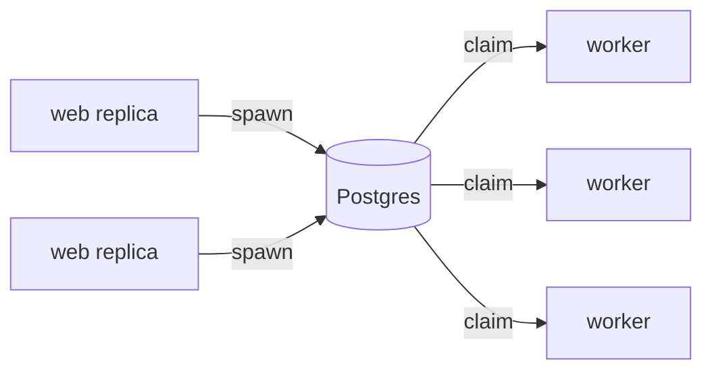

# Running in production

You've got a durable run working on your laptop. Now you want to ship it, to a web app that spawns work and a fleet of workers that does it. This page covers how the pieces split across processes, how to scale them, how to carry a conversation across runs, and the handful of gotchas that are much nicer to read about here than to discover at 3 a.m.

## Two processes, one database

The single most important idea for production is that **`spawn` and `start_worker` belong in different processes.**

- Your **web app** (or cron job, or queue consumer) calls `spawn`. It just writes a row to Postgres and returns. It stays small, fast, and stateless.
- Your **workers** call `start_worker`. They claim rows and run the agent. They're where the CPU, memory, and time go.

They never talk to each other directly, only through Postgres. Which means you can deploy them as separate containers and scale them independently.


```mermaid
flowchart LR
    Web1[web replica] -->|spawn| DB[(Postgres)]
    Web2[web replica] -->|spawn| DB
    DB -->|claim| W1[worker]
    DB -->|claim| W2[worker]
    DB -->|claim| W3[worker]
```

=== "Web process"

    ```python
    # Only needs to spawn. No agent, no task registration.
    absurd = AsyncAbsurd(DATABASE_URL, queue_name="agents")

    @app.post("/reports")
    async def create_report(prompt: str):
        handle = await absurd.spawn("analyse", {"prompt": prompt})
        return {"task_id": handle["task_id"]}
    ```

=== "Worker process"

    ```python
    # Registers the tasks and runs them.
    absurd = AsyncAbsurd(DATABASE_URL, queue_name="agents")
    agent = Agent("openai:gpt-5.2", name="analyst", capabilities=[AbsurdDurability()])

    @absurd.register_task(name="analyse")
    async def analyse(params, ctx):
        result = await agent.run(params["prompt"])
        return {"output": result.output}

    await absurd.start_worker()
    ```

!!! warning "Register tasks where they run"
    Tasks must be registered in the **worker** process, the one calling `start_worker()`, before the worker starts. The web process spawns by task *name* (`"analyse"`); it doesn't need the agent or the `@register_task` decorator at all. If a worker claims a task it hasn't registered, it fails it as unknown.

## Scaling workers

Because workers are just processes that poll the same Postgres queue, scaling is "run more of them." Two workers, ten workers, across machines, they coordinate through the database, each claiming different tasks. No leader, no coordinator, nothing extra to run.

When demand drops, scale them back down. Spawned tasks wait safely in Postgres until a worker is free, so a worker being temporarily gone never loses work.

## Carrying a conversation across runs

A single `spawn` is one run. But a chat is *many* turns, and each turn needs to remember the last. The way to do that is to pass the prior messages into the next run.

`agent.run()` accepts `message_history`, and a finished run gives you its messages back. So thread them through your task params:

```python hl_lines="4 5 8"
@absurd.register_task(name="chat")
async def chat(params, ctx):
    # `message_history` is None on the first turn, the prior conversation on later turns.
    history = params.get("message_history")
    result = await agent.run(
        params["prompt"],
        message_history=history,
    )
    return {
        "output": result.output,
        # Hand these back (they're JSON-serializable) so the next turn can continue.
        "all_messages": result.all_messages(),
    }
```

Your app stores `all_messages` between turns (in your own table, a cache, wherever), and passes them as `message_history` when it spawns the next turn. The run itself stays durable; the *conversation* is just data you carry forward.

!!! tip "pydantic-ai-absurd makes a run durable, not a conversation"
    Keeping the transcript is your application's job, and it's a small one. The library's promise is narrower and stronger: any single run, however long, resumes after a crash.

## Switching models per run

The agent needs a `model` at construction time (durability has nothing to bind to otherwise), but you can still route between models within a single agent. Register the alternatives on the capability and select one per run by id:

```python
agent = Agent(
    "openai:gpt-5.2",
    name="analyst",
    capabilities=[AbsurdDurability(models={"cheap": cheap_model})],
)

@absurd.register_task(name="analyse")
async def analyse(params, ctx):
    triage = await agent.run(params["prompt"], model="cheap")
    ...
```

The model id is folded into the checkpoint step name, so a replay resolves each cached response to the model that produced it. Plain model-name strings (`model="openai:gpt-4o"`) work too; registering via `models=` matters when the instance carries configuration a name alone wouldn't rebuild, and it keeps the checkpoint names stable and readable.

## Gotchas

A few things to know, each with a clear error (or a clear behavior) so you're never left guessing.

!!! danger "No `run_sync` inside a task"
    Absurd tasks are async, so there's no room for a blocking call on the worker's event loop. Always `await agent.run(...)` inside a task.

!!! danger "Toolsets are fixed at construction"
    Function and MCP toolsets must be on the agent when `AbsurdDurability` binds to it - that's when they're wrapped for checkpointing. Passing one to `agent.run(toolsets=...)` inside a task is rejected with a `UserError` (non-executing toolsets like `ExternalToolset` are fine).

!!! note "Streaming inside a task is a replay, not a live wire"
    `run_stream`, `run_stream_events`, and `iter` work inside a task: the model's stream is consumed inside the checkpointed step, then replayed to your code. That keeps the run replayable, but it means tokens don't cross the wire live - to react to events as they happen, set an `event_stream_handler` on `AbsurdDurability`; it runs inside the step, on the live stream. If you want to stream tokens to a user in real time, do that in your web layer with a run outside a task.

## You're ready

That's production. To recap the shape:

- [x] Web process spawns; worker process runs, split across containers
- [x] Register tasks in the worker
- [x] Scale by running more workers; tasks wait safely in Postgres
- [x] Carry conversations by threading `message_history` through your params
- [x] Register alternate models on the capability; stream live only outside a task

If something here didn't click, the **[How durability works](durability.md)** page has the underlying model, and the **[Tutorial](tutorial.md)** walks the happy path end to end.
