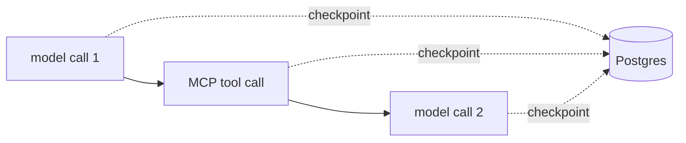

# How durability works

The tutorial showed you a run that survived a crash. This page explains *why* it survived, what exactly gets checkpointed, what doesn't, and the one behavior that will surprise you if nobody warns you about it.

It's worth understanding this. Not because it's complicated, it isn't, but because once you have the model in your head, you'll know precisely what's safe to do inside a task and what isn't.

## A step is a checkpoint

Absurd's core primitive is the **step**. A step is a piece of work that runs once and whose result is recorded in Postgres. When a task re-runs after a crash, any step that already completed doesn't run again, it returns its stored result.

You don't usually call steps yourself. `AbsurdAgent` does it for you, around every call the agent makes during a run:

- **Every model request.** Each call to the LLM is wrapped in a step. The `ModelResponse` is serialized to Postgres.
- **Every MCP tool call.** Each call to an MCP server is a step too.
- **Every function tool call.** Your own `@tool` functions are wrapped as well, so a tool with a side effect runs exactly once.

So a single `agent.run()` with one tool call becomes a little chain of checkpoints:



## What replay looks like

When a worker dies and the task is re-claimed, your task function runs **from the very top again**. That's the part people find counterintuitive at first, there's no magic jump to the middle. The whole function re-executes.

What makes it cheap is that the *steps* short-circuit:

| On the first run | On the replay |
| --- | --- |
| Model call 1 → calls the LLM, stores the response | Model call 1 → returns the **stored** response, no LLM call |
| Tool call → hits the MCP server, stores the result | Tool call → returns the **stored** result, no MCP call |
| Model call 2 → crashes here :material-skull: | Model call 2 → runs for real this time |

So replay is fast and free up to the point where the crash happened, then continues normally. You resume, you don't restart.

!!! tip "The expensive things are the durable things"
    Model calls, MCP calls, and tool calls are exactly the operations that cost money, take time, or change the outside world. Those are the ones Absurd checkpoints. That's not a coincidence, it's the whole design.

## What is *not* a checkpoint

Here's the part to internalize: **your plain Python is not a step.**

```python
@absurd.register_task(name="report")
async def report(params, ctx):
    print("starting")          # not a step: runs again on every replay
    await send_slack("on it")  # not a step: this Slack message goes out AGAIN on replay
    result = await agent.run(params["prompt"])  # the model calls inside HERE are steps
    return {"output": result.output}
```

When the task re-runs, everything that isn't a checkpointed step runs again from scratch. The `print` prints again. The `send_slack` sends again. Only the calls *inside* `agent.run()`, the model, MCP, and function tool calls, short-circuit.

This is usually fine, most code in a task is either cheap (logging) or naturally idempotent. But if you have a side effect that *must* happen exactly once, you need to make it a step yourself.

## Making your own steps

Anything you want to run exactly once across replays, wrap in `ctx.step`:

```python hl_lines="3 4"
@absurd.register_task(name="report")
async def report(params, ctx):
    # Now this runs once, even if the task replays.
    await ctx.step("notify", lambda: send_slack("on it"))
    result = await agent.run(params["prompt"])
    return {"output": result.output}
```

`ctx.step(name, fn)` runs `fn` the first time and records its result. On replay, it returns the recorded result instead of calling `fn` again. The `name` identifies the checkpoint, so keep it stable and unique within the task.

!!! warning "Steps must be deterministic in shape"
    The sequence of step names a task produces should be the same every time it runs. Don't make a step conditional on something random or time-based, or the replay won't line up with the original. Think "same inputs, same steps."

## The surprise: spawn-time idempotency

One more thing, because it *will* bite you otherwise.

If two different parts of your system spawn the "same" task, you might not want it to run twice. Absurd handles this with an **idempotency key** on `spawn`: two spawns with the same key resolve to the same task instead of creating a second one.

```python
async def main():
    await absurd.spawn(
        "analyse",
        {"prompt": "Analyse Q3 revenue"},
        idempotency_key="report-2026-q3",
    )
```

Spawn that a hundred times with the same `idempotency_key` and you get one task, one run, one result.

This is separate from step checkpointing. Steps make a *single run* resumable; the idempotency key makes *multiple spawn calls* collapse into one run. You'll want the second one whenever a user might double-click, a webhook might be delivered twice, or a retry might re-trigger your endpoint.

## The one-paragraph summary

Inside a run, **model, MCP, and tool calls are checkpoints**, so a crash resumes from the last one without re-spending tokens or repeating a side effect. The plain Python in your task body is **not** a checkpoint, so it re-runs on replay, wrap anything there that must happen once in `ctx.step`. Across spawns, an **idempotency key** keeps duplicate triggers from launching duplicate runs.

That's the entire durability model. Next: what happens when your agent uses **[tools and MCP servers](mcp.md)**.
