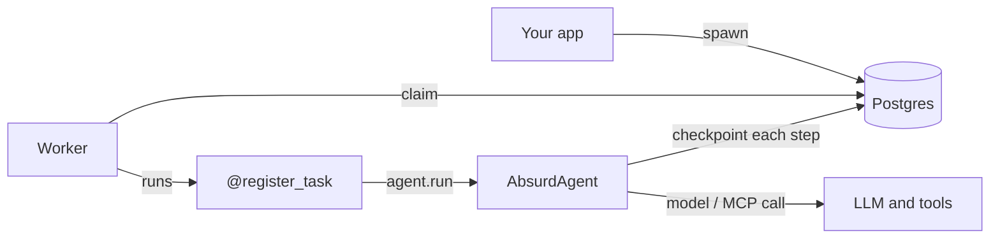

# Pydantic AI Absurd

<p align="center"><em>Durable execution for Pydantic AI agents, on Postgres alone.</em></p>

---

When you put an agent in production, something uncomfortable happens: it runs for a while.

A real agent call isn't one HTTP request. It's a model call, then a tool call, then *another* model call, maybe an MCP server in the middle — tens of seconds, sometimes minutes. And in those seconds, things go wrong. Your worker gets redeployed. The machine runs out of memory. A spot instance disappears. The process you were counting on is simply *gone*.

So what happens to the run?

With most setups, the answer is: it's lost. You start again from the beginning — and you pay for every token again, you run every side effect again, and your user waits twice.

**pydantic-ai-absurd** makes that not happen. You call `agent.run()` inside a durable task, and every model call and every MCP call is checkpointed into Postgres. If the worker dies halfway through, a new worker picks the task back up and *resumes from the last completed step* — no restart, no re-spent tokens.

It's the same idea as Pydantic AI's Temporal integration. The difference: **no Temporal, no Redis, no broker, no daemon.** Just the Postgres you already have.

## A taste

```python
from absurd_sdk import AsyncAbsurd
from pydantic_ai import Agent
from pydantic_ai_absurd import AbsurdAgent

absurd = AsyncAbsurd("postgresql://localhost/absurd", queue_name="agents")
agent = AbsurdAgent(Agent("openai:gpt-5.2", name="analyst"), absurd)

# You write the task; the agent is a durable callable inside it.
@absurd.register_task(name="analyse")
async def analyse(params, ctx):
    result = await agent.run(params["prompt"])
    return {"output": result.output}

# Spawn from anywhere — it just writes to Postgres and returns immediately.
await absurd.spawn("analyse", {"prompt": "Analyse Q3 revenue"})

# Run the worker in a separate process — it claims the task and runs it.
await absurd.start_worker()
```

That's the whole shape. You author a task, call the agent inside it, spawn it from one place, run it from another.

- **You write the task.** Every model and MCP call inside `agent.run()` is a checkpoint.
- **`spawn` doesn't run the agent.** It records a request to run it — durably, somewhere — and returns immediately, so your web request stays fast.
- **The worker does the work.** If it crashes mid-run, another worker resumes from the last checkpoint instead of starting over.

## The mental model



The task lives in Postgres, so the side that *asks* for work and the side that *does* it are completely decoupled. They can be different processes, different containers, different machines — they only ever talk through the database.

## Why you'd want this

<div class="grid cards" markdown>

-   :material-database: __Postgres is the whole stack__

    No new infrastructure to run, secure, and pay for. If you have a database, you have durable agents.

-   :material-restore: __Crashes resume, they don't restart__

    Completed model and tool calls replay from their checkpoint. A redeploy mid-run costs you nothing.

-   :material-currency-usd-off: __Tokens are spent once__

    The expensive thing — the LLM call you already made — comes back from cache on replay. You don't pay twice.

-   :material-vector-combine: __It's just Pydantic AI__

    `AbsurdAgent` wraps a normal `Agent`. Your tools, your output types, your model — all the same.

</div>

## When *not* to reach for it

Be honest with yourself here, because durability has a cost in moving parts.

If your agent call is fast, stateless, and you're happy to just retry it from scratch when it fails — you don't need this. A plain `agent.run()` behind a `try`/`except` is simpler, and simpler is better.

You want pydantic-ai-absurd when a *single run* is long enough, expensive enough, or has side effects important enough that **restarting from zero is not acceptable.** That's the line.

## Where to go next

<div class="grid cards" markdown>

-   :material-school: __[Tutorial - User Guide](tutorial.md)__

    Zero to a working durable run, one step at a time. Start here.

-   :material-cog: __[How durability works](durability.md)__

    What's checkpointed, what isn't, and exactly what happens on a crash.

-   :material-tools: __[Tools & MCP servers](mcp.md)__

    Your agent uses tools — here's what's durable and what you control.

-   :material-server-network: __[Running in production](deployment.md)__

    Two processes, scaling workers, multi-turn conversations, and the gotchas.

</div>

## Install

```bash
pip install pydantic-ai-absurd
```

You'll need a Postgres database (that's where Absurd keeps its state) and a Pydantic AI `Agent`. That's it.
