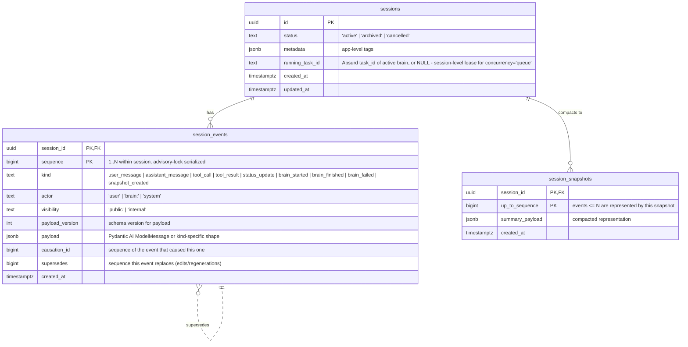
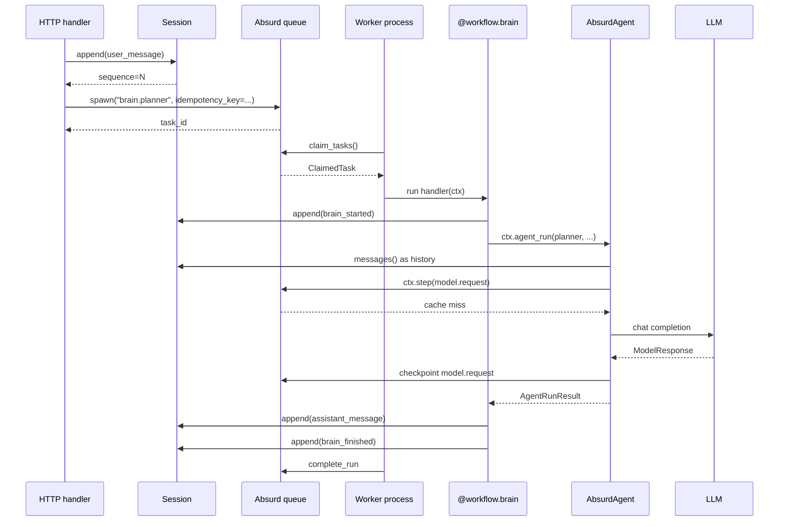

# agent-sessions architecture

## The two axes

Two orthogonal things live in Postgres when you use this package, both namespaced to avoid colliding with your application tables:

- **Absurd's tables** (`absurd.*` schema) — "who is doing which work, and what's its checkpoint state." One row per in-flight task, one row per `ctx.step()` call. Owned by Absurd; we never read or write these directly.
- **Our tables** (`agent_sessions.*` schema) — `sessions`, `session_events`, `session_snapshots`. "What is the user-observable conversation, regardless of who authored it and across which task retries." Durable, append-only, agent-facing.

One chat turn might retry through three Absurd tasks (each with its own checkpoint state), but produce exactly one row in `agent_sessions.session_events` — the final assistant message. Absurd's tables can't express that; that's why a separate event log exists.

## Data model

All tables live under the `agent_sessions` Postgres schema; the diagram below elides the prefix for readability.

## Tables in detail

### `sessions`

One row per conversation. Created with `Session.create(pool, metadata=...)`, loaded with `Session.load(pool, id)`. The `metadata` JSONB is for your application (e.g. `{"user_id": ..., "tenant": ..., "thread_title": ...}`) — this package doesn't read it. `status` is intentionally a free-form `TEXT` so apps can introduce their own lifecycle states.

### `session_events`

The central append-only log. Every append goes through `Session.append(...)`, which:

1. Takes a transaction-scoped advisory lock keyed by `hashtextextended(session_id, 0)`. This serializes appenders on the same session; different sessions remain fully parallel.
2. `SELECT COALESCE(MAX(sequence), 0) + 1` to get the next sequence.
3. Inserts the row.
4. `UPDATE sessions SET updated_at = now()`.
5. Fires `pg_notify('agent_sessions_<hex>', '<sequence>')` so `Session.listen()` consumers see it on commit.

All of that runs in a single transaction; commit makes the row and the notify visible together. The advisory lock guarantees there are no `(session_id, sequence)` collisions without needing a retry loop.

**Kind / visibility combinations:**

| `kind`              | typical `visibility` | payload shape                                |
|---------------------|----------------------|----------------------------------------------|
| `user_message`      | public               | Pydantic AI `ModelRequest` JSON              |
| `assistant_message` | public               | Pydantic AI `ModelResponse` JSON or `{"content": str}` for plain `ctx.post(...)` |
| `tool_call`         | internal             | `ModelResponse` carrying only tool calls     |
| `tool_result`       | internal             | `ModelRequest` carrying only tool returns    |
| `status_update`     | public               | `{"content": str}`                           |
| `brain_started`     | internal             | `{"brain": str}`                             |
| `brain_finished`    | internal             | `{"brain": str}`                             |
| `brain_failed`      | internal             | `{"error": str}`                             |
| `snapshot_created`  | internal             | `{"up_to_sequence": N}`                      |

**Reads:**

- `session.events(after=N, visibility=Visibility.public)` — for the UI. Incremental, filterable by visibility.
- `session.messages()` — for an LLM. Skips the latest snapshot, converts events into `list[ModelMessage]` via `_pydantic_ai.py`. Events whose kind isn't a `ModelMessage` (e.g. `status_update`, lifecycle) are filtered out.
- `session.listen(conninfo=...)` — real-time push. Two connections: a dedicated autocommit one for `LISTEN`, a pooled one for the row lookup on each notify. (Psycopg3's notify polling is stateful on its connection, so unrelated queries on that same connection break it — keep them separated.)

**`causation_id` and `supersedes`:**

- `causation_id` — the `sequence` of the event that caused this one. When a brain appends via `BrainContext`, every append carries the `brain_started` event's sequence as its causation. When a brain wakes another brain, the new `brain_started` carries the previous brain's `brain_started.sequence`. Chaining these back gives you the full wake chain. `max_wake_depth` follows the chain on every wake and refuses to spawn beyond the configured depth.
- `supersedes` — reserved for edit/regenerate flows (e.g. a user re-asks the same question, the new `user_message` supersedes the previous one). Not written anywhere by this package yet; here because changing the schema later is harder than putting the column in from day one.

### `session_snapshots`

Compaction floor. When a session gets long, write one row with `up_to_sequence=N` and a `summary_payload` (usually the LLM-generated gist of events 1..N). `Session.messages()` starts from the latest snapshot's `up_to_sequence` instead of from zero. The snapshot itself is opaque JSONB — the app (or a summarizer agent you write) owns the summary format.

We don't ship any compaction strategy classes yet. The primitives are `session.create_snapshot(up_to_sequence=N, summary_payload={...})` plus the automatic floor in `messages()`. Call it whenever you want.

## Runtime flow

On a crash after the `LLM->Agent` step but before `complete_run`:

- Absurd re-enqueues the task.
- A new worker claims it.
- `ctx.agent_run()` runs again from scratch — but the `ctx.step(model.request)` checkpoint is already persisted, so it returns the cached `ModelResponse` without calling the LLM.
- The brain appends `assistant_message` (again — see below) and completes.

## Idempotency and deduplication

Two separate mechanisms:

- **Between two calls to `workflow.wake(...)`:** Absurd's native `idempotency_key`. Two wakes with the same key resolve to the same task_id without spawning twice. If you don't pass `dedup_key`, it's derived from `(session_id, brain_name, sha256(json(input)))`.
- **Inside a single brain run that retries:** Absurd's step checkpoints. The LLM call and MCP tool calls are cached per `ctx.step(name)` — on replay they return the stored value. **`session.append(...)` is not a step**, so on replay a brain that appends before it reaches a checkpoint-returning step will append the event twice.

This is an intentional tradeoff: if your brain posts a `status_update` then calls the LLM, and it crashes mid-LLM-call and retries, you get two `status_update` events — one from the failed attempt, one from the replay. For the current visibility rules (status updates are cheap, agent-visible messages only come from `agent_run()` which is deterministic via the checkpoint), this is acceptable noise.

Brains that must be idempotent on the session log should wrap non-idempotent appends in `ctx.absurd_ctx.step(...)` themselves.

## Concurrency inside a session

By default, `workflow.wake(session, name)` enqueues with `concurrency="queue"` — the brain handler takes a **row-level lease** on `agent_sessions.sessions.running_task_id` via a CAS update (`UPDATE ... SET running_task_id = ? WHERE id = ? AND running_task_id IS NULL`). If another brain on the same session holds the lease, the new one calls `ctx.sleep_for(...)` (Absurd's durable sleep), returning its pool connection and its worker slot, and retries after the configured `session_lease_poll_seconds` (default 1s).

This is intentionally a lease, not a Postgres advisory lock. Advisory locks are bound to the connection that acquired them, so holding one for the brain's lifetime would pin a pool connection — and under concurrent sessions that starves the pool, blocking `session.append()` on the brain's own other queries. The lease touches the pool only for the brief CAS queries; between polls the task is suspended, not holding anything.

This is session-scoped, not brain-scoped. Two different sessions run fully in parallel. `concurrency="parallel"` skips the lock — useful for read-only brains or ones that write to their own scoped subtree.

`concurrency="supersede"` uses the lease's second column (`running_brain_name`) to locate the currently-active brain for this `(session_id, brain_name)` pair and cancels its Absurd task via `absurd.cancel_task()` before spawning the replacement. The cancelled brain's exception handler releases the lease, the new spawn acquires it normally. Pending tasks that haven't yet taken the lease are not touched — the common case (a user retrying) only needs to cancel the live run.

Durable sleeps inside a leased brain (e.g. `ctx.sleep_for(...)` or `ctx.await_event(...)`) keep the lease held. From the session's perspective the brain is "running and waiting," not "finished" — so nothing else can barge in during the wait, and `supersede` still finds a live lease to target.

## Schema migrations

The canonical schema lives at `agent_sessions/schema/agent_sessions.sql` and represents the current library version. The last statement in that file is a `CREATE OR REPLACE FUNCTION agent_sessions.get_schema_version()` that returns the current version as a text literal. The running value of that function is how the database advertises "what version am I?"

`apply_migrations(pool)` does the right thing depending on state:

- **Fresh install** (function doesn't exist): run `agent_sessions.sql` inside a transaction. Creates every table and registers the version function.
- **Up-to-date** (function returns the current version): no-op.
- **Older version**: walk `agent_sessions/schema/migrations/<from>-<to>.sql` from the installed version to the current one. Each migration runs in its own transaction and ends by redefining `get_schema_version()` to its new value, so a failure leaves the database at a known intermediate version.

Invariants enforced at import time:

- Every migration filename must match `<from>-<to>.sql` where both ends are semver-ish (`MAJOR.MINOR.PATCH`).
- No two migrations may share the same `from` version - a branching history is a deploy error, not a "pick one" situation.

Invariants enforced at runtime:

- If the database reports a version for which we don't ship an outgoing migration, `apply_migrations()` raises and touches nothing. This is the "someone downgraded the library" case - manual intervention is safer than guessing.

`apply_migrations()` is not concurrency-safe across processes. Run it once from your deployment's release hook, not from every worker on startup.

## Why not store events in Absurd's tables?

Absurd's task state is tied to a single task instance. If a task retries, its checkpoints carry over, but the task_id changes if you spawn a new task for a chained brain. A user-observable conversation needs to span tasks — the `user_message` the browser POSTed is part of the same conversation as the `assistant_message` three brains later, even though each brain is a distinct Absurd task.

We need a table where the primary key is `(session_id, sequence)`, not `(task_id, checkpoint_name)`. That's what `session_events` is.
